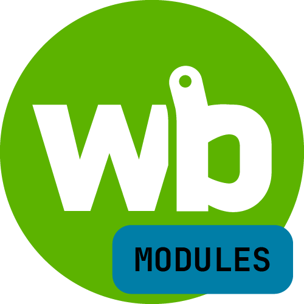

<h1 align="center">
   
  
   
  <b>Модули и шаблоны для контроллера WirenBoard</b>
   
</h1>

## :scroll: Мои модули для движка правил **wb-rules** компании Wiren Board. А так же мои шаблоны для сторонних устройств.

**При написании кода использовал:**

- [Официальная документация с описанием движка **wb-rules** на GitHub](https://github.com/wirenboard/wb-rules/tree/master)
- [Репозиторий для файлов сообщества wb-community](https://github.com/wirenboard/wb-community/tree/main)
- [Примеры правил на официальной странице Wiren Board](https://wirenboard.com/wiki/Rule_Examples)
- [Описание работы драйвера **wb-mqtt-serial**](https://github.com/wirenboard/wb-mqtt-serial?tab=readme-ov-file#шаблоны-конфигурации)

### Модули для движка правил wb-rules
- [moduleButtonLight](https://github.com/SmithLEDs/wb-buttonLight.git) - Модуль для управления светом по кнопкам и датчикам движения
- [moduleConverterMAP](https://github.com/SmithLEDs/wb-converterMAP.git) - Конвертер получаемых данных от счётчика электроэнергии WB-MAP

### Шаблоны для сторонних устройств
- [config-Lovato-RGK800](https://github.com/SmithLEDs/wb-template_LovatoRGK800.git) - Шаблон для контроллера ДГУ Lovato RGK800

### Установка модулей в контроллер

1. Для установки надо файл модуля, расположенный в папке `wb-rules-modules` загрузить на котроллер в папку `/mnt/data/etc/wb-rules-modules`.
2. Далее создать правило через WEB интерфейс контроллера и скопировать туда текст из примера, расположенный в папке `wb-rules` готового модуля.
3. Отредактировать устройства из примера под свои (`device/control`).
3. Нажать кнопку Сохранить и проверять работу модуля.

### Установка шаблонов в контроллер

1. Файл шаблона `config-<бренд>-<модель-устройства>.json` загрузить на контроллер в папку `/etc/wb-mqtt-serial.conf.d/templates`.
2. После добавления шаблона конфигурации вы можете выбрать новое устройство из выпадающего списка в настройках serial устройств в веб-интерфейсе контроллера Wiren Board.

### :bangbang: Подключение к контроллеру 
Для удобства подключения к контроллеру можно использовать программу [WinSCP](https://winscp.net/eng/download.php). С помощью данной программы можно подключиться к контроллеру по протоколу SFTP и получить доступ к файловой системе, не прибегая к использованию консоли.

* `/mnt/data/etc/wb-rules-modules` - Расположение файлов модулей
* `/mnt/data/etc/wb-rules` - Расположение файлов правил (скриптов)
* `/etc/wb-mqtt-serial.conf.d/templates` - Расположение файлов шаблонов сторонних устройств

