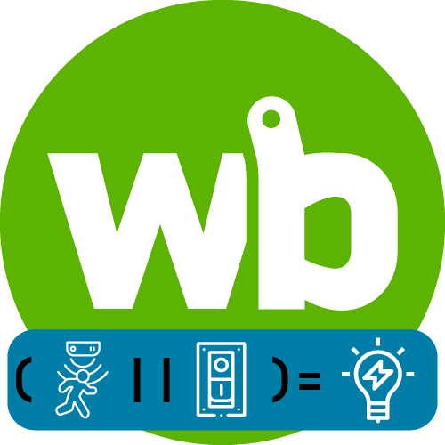

<h1 align="left">
  <br>
  
  <br>
  <b>Модуль для управления группой света</b>
  <br>
</h1>


### Описание

Данный модуль создает новое виртуальное устройство с новыми контролами для управления светом. 

* Реализована возможность одновременного управления не только одним реле, но и множеством реле.
* Управление из WEB интерфейса по виртуальной кнопке или с физических кнопок или выключателей. Можно указать множество кнопок.
* Есть возможность управления по датчикам движения.

### Примеры

На этом этапе у вас уже должен быть загружен модуль в контроллер. Смотри инструкцию на [главной странице](https://github.com/SmithLEDs/wb_module/tree/main).

**Одна лампочка - один выключатель.** Классический пример по управлению одной нагрузкой с одного выключателя. В функцию `createLightingGroup` передаем четыре параметра:
1. Описание виртуального устройства (Можно на русском)
2. Имя виртуального устройства (Будет отображаться в новом виртуальном кстройстве как name/... )
3. Одиночный топик или массив топиков, по изменению которых будет происходить переключение света (Кнопки, выключатели)
4. Одиночный топик или массив топиков, которыми будет происходить управление (Реле)

```js
var button = require('moduleButtonLight'); // Подключим наш модуль


var but = 'testButton/Input 1';     // Создаем переменную с указанием топика физической кнопки
                                    // или 'testButton/Input 1 counter' для выключателя без фиксации
var light = 'wb-mr6c_1/K5';         // Создаем переменную с указанием реле, на которое подключена лампочка

// Создаем виртуальное устройства при помощи подключенного модуля
button.createLightingGroup('Свет на кухне' , 'Light_kitchen' , but , light );    
```
<h1 align="center">
  <br>
  
  <br>
  <b>Модули для правил wb-rules</b>
  <br>
</h1>

